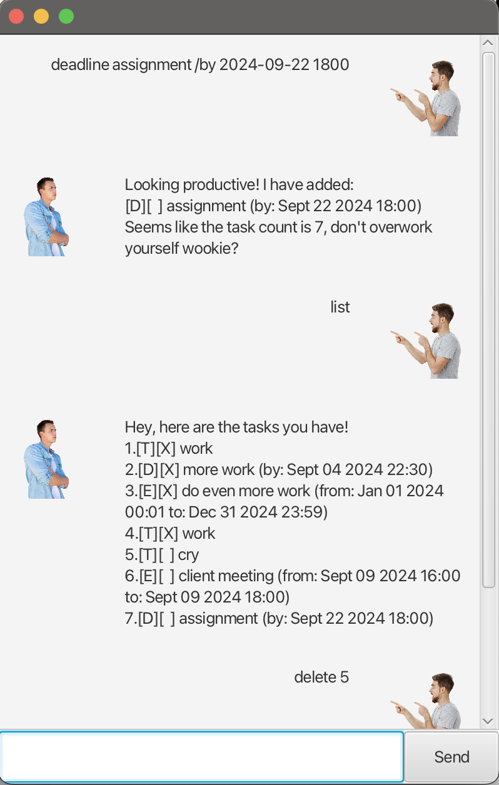

# Handsome User Guide



Need someone to help you? Handsome is here to help! 😉 

It is:
* user friendly
* fun SUPER FUN to talk to 🤠
* REALLY QUICK to learn


All you need to do is,

1. download it.
2. double-click the file.
3. add your tasks.
4. sit back as you enjoy more free time 🕰️

Features:
1. [x] Managing tasks
2. [x] Managing deadlines 
3. [x] Managing events 

## Adding todos

Todo allows you to add a task with an unspecified due date.

The yyyy-MM-dd HHmm format needs to be adhered in order for the chatbot to work.

Example: `todo (task)`

**_sample input:_**

todo assignment 


_**sample output:**_
```
[T][ ] assignment 

```

## Adding deadlines

Deadlines allow you to add tasks with a specified due date.

The yyyy-MM-dd HHmm format needs to be adhered in order for the chatbot to work.

Example: `deadline (task) /by (yyyy-MM-dd HHmm)`

_**sample input:**_

deadline work /by 2024-09-09 1800


_**sample output:**_
```
[D][ ] work (by: Sept 09 2024 18:00)

```

## Adding events

Allows the user to add an event from and to specified times.

The yyyy-MM-dd HHmm format needs to be adhered in order for the chatbot to work.

Example: `event (task) /from (yyyy-MM-dd HHmm) /to (yyyy-MM-dd HHmm)`

_**sample input:**_

event client meeting /from 2024-09-09 1600 /to 2024-09-09 1800


_**sample output:**_
```
[E][ ] client meeting (from: Sept 09 2024 16:00 to: Sept 09 2024 18:00)

```
## Mark
Mark allows the user to record a task as completed.

Simply type in "mark" (no quotation marks) and the task number e.g. "5", and that task will be recorded as completed
by an 'X'.

Example: `mark 5`

## Unmark
Unmark allows the user to record a task as not completed.

Simply type in "unmark" (no quotation marks) and the task number e.g. "5", and that task will be recorded as not
completed by ' '.

Example: `unmark 5`
## Delete
Delete allows the user to delete a chosen task.

Simply type in "delete" (no quotation marks) and the task number e.g. "5", and that task will be deleted and no longer
stored.

Example: `delete 5`

## List
List allows you to view all of your existing tasks.

Simply enter "list" (without the quotation marks) and Handsome will show you all the tasks you have.

Example: `list`
## Find
Find allows the user to find a task with the specified keywords.

It returns a list of corresponding tasks with the specified keywords and if there are no matching tasks, find returns 
"Sadly, no matching tasks found."

Simply type in "find" (no quotation marks) and the keywords e.g. "more work", and the corresponding tasks will be 
returned in a list.

Example: `find more work`

## Undo

Undo allows you to undo the last command that you have given to Handsome!

Simply enter "undo" (without the quotation marks) and Handsome will revert whatever your last command
was.

Example: `undo`
## Bye

Once you are done with Handsome, just say "bye" and the bot will greet you off!

Example: `bye`
## Credits
https://se-education.org/guides/tutorials/javaFx.html

Handsome Bot Image:
<a href="https://www.freepik.com/free-photo/pensive-focused-student-guy-with-folded-arms_6882488.htm#fromView=search&page=1&position=42&uuid=a5ec7d86-c5e4-4fea-9e16-10a7c0a9caff">Image by pch.vector on Freepik</a>

Handsome User (you!) Image:
<a href="https://www.freepik.com/free-photo/surprised-impressed-handsome-guy-standing-profile-with-dropped-jaw-intrigued-look-pointing-looking-left-astonished-speechless-white-wall_9987347.htm#fromView=search&page=1&position=1&uuid=3e5ae9c3-9976-423d-b9cb-faa59ab806ac">Image by cookie_studio on Freepik</a>
